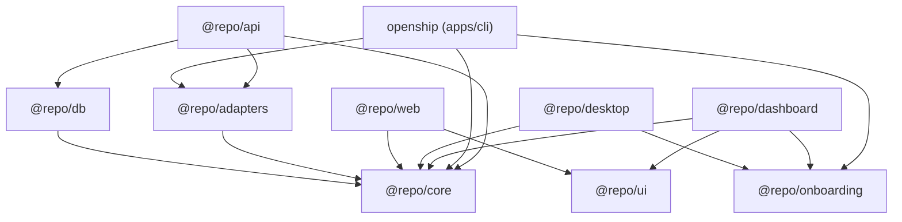

# Openship 依赖图（FE0-D0）

> Part of [Epic #1](https://github.com/X44421/openship/issues/9) · 三层：import / runtime / dataflow · 节点与 [openship-inventory.md](./openship-inventory.md) 行一一对应

## 1. import 层（声明级依赖，证据 = 各 package.json 的 @repo/* 边）

叶子包：`core`、`ui`、`onboarding`、`db-email`、`email`（无内部出边）。无任何反向边（core/ui 不依赖上层）——当前声明图**无环**。

## 2. runtime 层

| 链路 | 路径 | evidence |
| --- | --- | --- |
| 浏览器 → dashboard/web | Next.js SSR/静态资源由 `api` 或平台托管 | docker-compose services：dashboard、web |
| api → 存储/队列 | hono 进程 → Postgres(drizzle) + Redis(bullmq/ioredis) | apps/api deps；compose services postgres/redis |
| desktop → 远端 dashboard | Electron 壳加载已部署 dashboard URL | apps/desktop description「Electron wrapper for the deployed…」；**待复核**：main 进程是否内嵌本地服务（D0 复核项，见 §4） |
| studio → 本地执行器 | dashboard(studio) 直接 import `@repo/core/clean` 在浏览器执行清洗 | boundaries 文档 B2/B6 —— **越界链路** |

## 3. dataflow 层

| 数据流 | 路径 | 备注 |
| --- | --- | --- |
| 业务控制数据 | dashboard 表单 → api → drizzle → Postgres | FE5-D2 迁移对象 |
| 部署流 | cli/dashboard → adapters(dockerfile/compose/infra) → 目标主机 | 旧产品核心能力，客户端套件整体移除 |
| 清洗演示流 | studio 拖拽 op → core/clean 本地执行 → 假 Preview 结果 | **必须**由 stillflow Preview API 替代（boundaries B2） |
| 邮件流 | email(db-email vmail) 独立子系统 | 与主链无耦合，可独立退役 |

## 4. 待复核项（不阻塞本图成立）

1. desktop main 进程运行时行为（是否仅远程加载）；
2. ui 组件被引用的具体面（影响 FE1-S2 retain/adapt）；
3. fixtures/ 目录内容与引用方。
